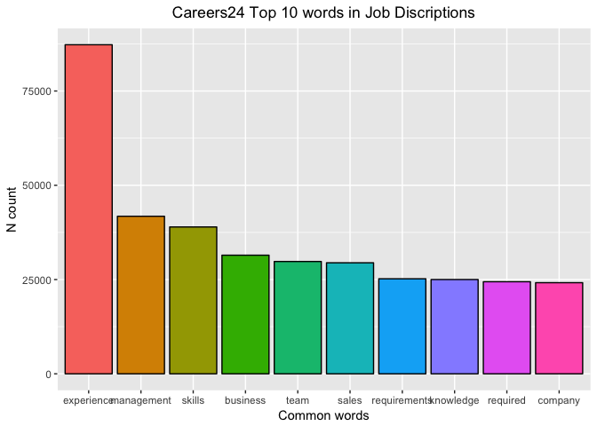
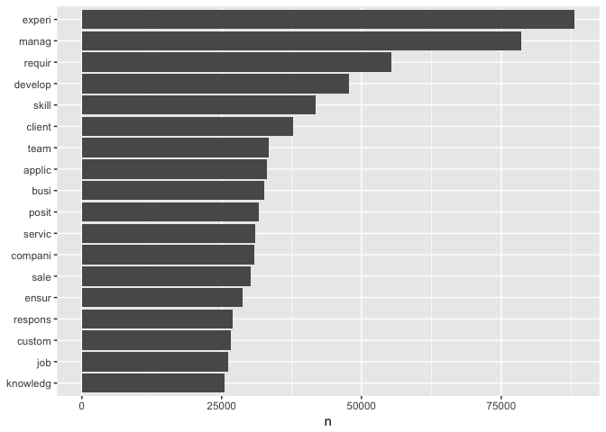
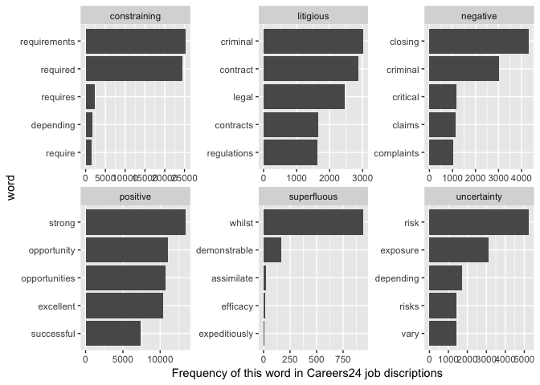

<style>
body {
text-align: justify}
</style>

# Introduction

This article serves as a basic introduction to text mining in R using the `tidytext` package. Specifically it looks as text mining job descriptions on [Careers24](http://www.careers24.com/), one of the leading job portals in South Africa.

Text mining usually involves the process of structuring the input text. The overarching goal is, essentially, to turn text into data for analysis, via application of natural language processing (NLP) and analytical methods.


# The Tidy Text 

The job descriptions on [Careers24](http://www.careers24.com/) are typical character vectors that we might want to analyse. In order to turn it into a tidy text dataset, we first need to put it into a data frame.

```r
text_df_career24 <- data_frame(line = 1:57837, text = careers24.data$job.description)
text_df_career24
```

```
## # A tibble: 57,837 x 2
##     line text                                                             
##    <int> <chr>                                                            
##  1     1 Senior Enterprise Architect Leading consulting house looking for~
##  2     2 A well established firm based in the East Rand is looking for SA~
##  3     3 A well established and dynamic firm based in the East Rand is lo~
##  4     4 C# Developers needed  Centurion  Negotiable between R35k and R50~
##  5     5 Senior C# needed  JHB  Negotiable between R500k and R720kJOB DES~
##  6     6 " To build relationships with clients To give objective professi~
##  7     7 Would you like to become a Financial Adviser? Join our 2 year tr~
##  8     8 Guest RelationsTrainingDuty ManagementStaff Management Five star~
##  9     9 Tired of waitressing?Tired of not making enough money and workin~
## 10    10 five star hotel is seeking a Reservations agentRoom Reservations~
## # ... with 57,827 more rows
```

However, this data frame isn’t yet compatible with tidy text analysis. We can’t filter out words or count which occur most frequently, since each row is made up of multiple combined words. We need to convert this so that it has one-token-per-description-per-row. To do this, we use tidytext’s `unnest_tokens()` function.


```r
tidy_c24_job_discription <- text_df_career24 %>%
                            unnest_tokens(word, text, token = "words", to_lower = TRUE)
tidy_c24_job_discription
```

```
## # A tibble: 10,482,892 x 2
##     line word      
##    <int> <chr>     
##  1     1 senior    
##  2     1 enterprise
##  3     1 architect 
##  4     1 leading   
##  5     1 consulting
##  6     1 house     
##  7     1 looking   
##  8     1 for       
##  9     1 a         
## 10     1 senior    
## # ... with 10,482,882 more rows
```

Now that the data is in one-word-per-row format, we can manipulate it with tidy tools like `dplyr`. Often in text analysis, we will want to remove stop words; stop words are words that are not useful for an analysis, typically extremely common words such as “the”, “of”, “to”, and so forth in English. We can remove stop words (kept in the tidytext dataset `stop_words`) with an `anti_join()`. 

Furthermore, after close examination of the job descriptions it was found that every description ended with the same two sentences (by default): "Companies may expire jobs at their own discretion. If you have not received a response within two weeks your application was most likely unsuccessful." Therefore, these words were also removed for the job descriptions.


```r
tidy_c24_job_discription <- tidy_c24_job_discription %>%
                            anti_join(stop_words) %>%
                            filter(!word %in% text_df$word)
```

```
## Joining, by = "word"
```
We can now use dplyr’s `count()` to find the most common words in all the job descriptions as a whole.

```r
tidy_c24_count <- tidy_c24_job_discription %>%
  count(word, sort = TRUE) 
tidy_c24_count
```

```
## # A tibble: 185,620 x 2
##    word             n
##    <chr>        <int>
##  1 experience   87274
##  2 management   41781
##  3 skills       38945
##  4 business     31455
##  5 team         29782
##  6 sales        29443
##  7 requirements 25201
##  8 knowledge    25005
##  9 required     24420
## 10 company      24164
## # ... with 185,610 more rows
```


```r
#top 10 words
ggplot(data=tidy_c24_count[1:10,],aes(x=word,y=n,fill=word))+
  geom_bar(colour="black",stat="identity")+
  xlab("Common words")+ylab("N count")+ggtitle("Careers24 Top 10 words in Job Discriptions")+
  guides(fill=FALSE)+theme(plot.title = element_text(hjust = 0.5))
```

<!-- -->

# Sentiment Analysis on Careers24 Job Discriptions

```r
bing_word_counts <- tidy_c24_job_discription %>%
  inner_join(get_sentiments("bing")) %>%
  count(word, sentiment, sort = TRUE) %>%
  ungroup()
```

```
## Joining, by = "word"
```

```r
bing_word_counts %>%
  group_by(sentiment) %>%
  top_n(8) %>%
  ungroup() %>%
  mutate(word = reorder(word, n)) %>%
  ggplot(aes(word, n, fill = sentiment)) +
  geom_col(show.legend = FALSE) +
  facet_wrap(~sentiment, scales = "free_y") +
  labs(y = "Contribution to sentiment",
       x = NULL) +
  coord_flip()
```

```
## Selecting by n
```

<!-- -->

```r
tidy_c24_job_discription %>%
  count(word) %>%
  inner_join(get_sentiments("loughran"), by = "word") %>%
  group_by(sentiment) %>%
  top_n(5, n) %>%
  ungroup() %>%
  mutate(word = reorder(word, n)) %>%
  ggplot(aes(word, n)) +
  geom_col() +
  coord_flip() +
  facet_wrap(~ sentiment, scales = "free") +
  ylab("Frequency of this word in Careers24 job discriptions")
```

<!-- -->


